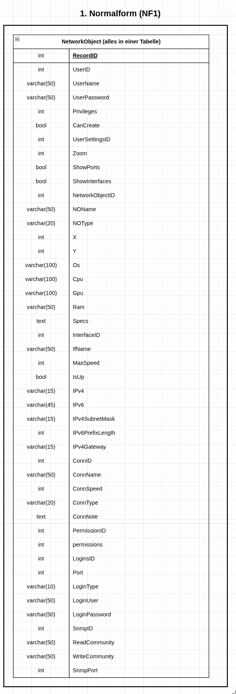
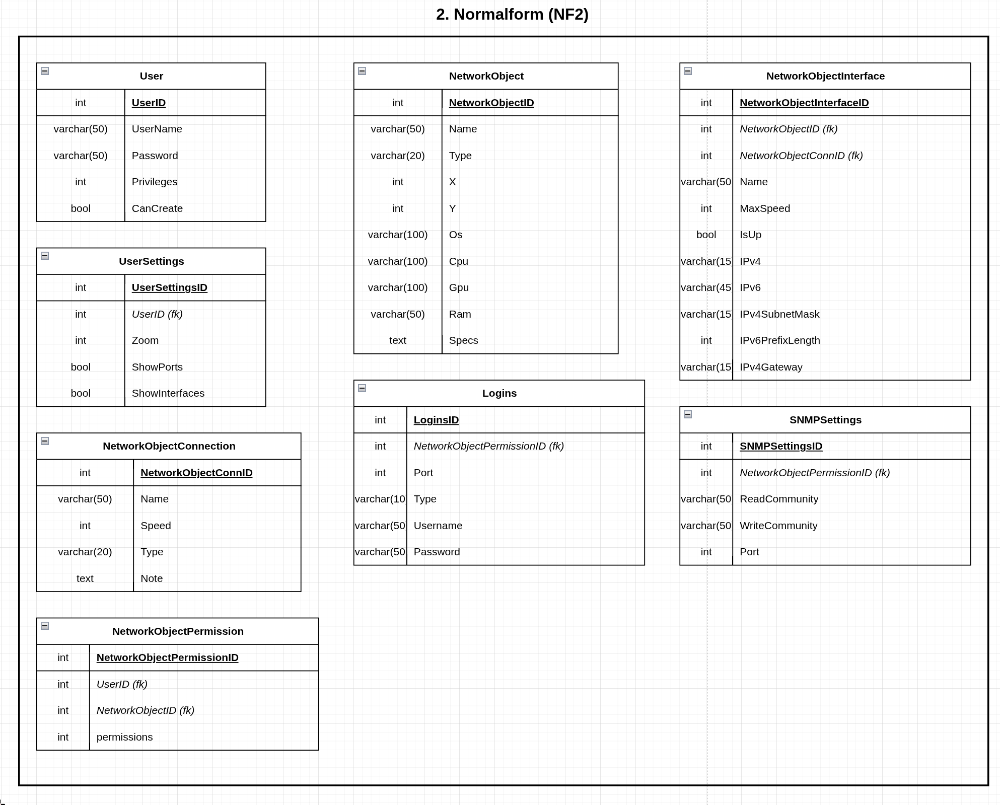
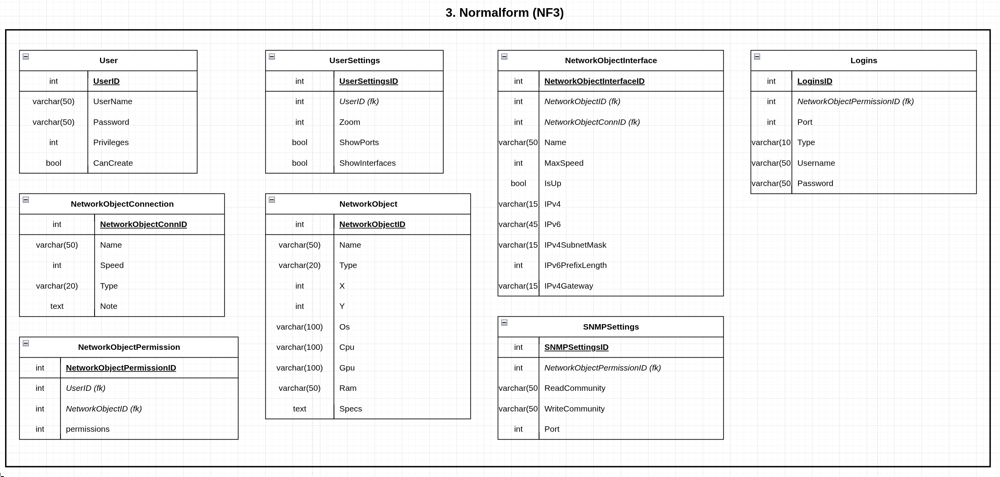
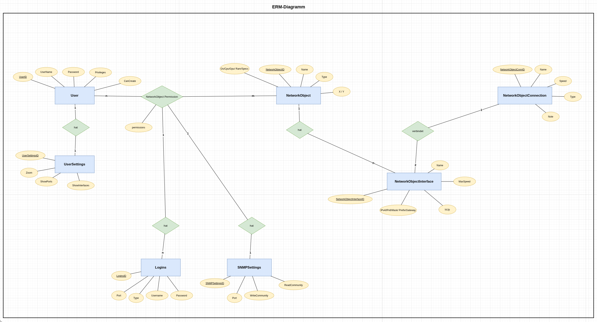
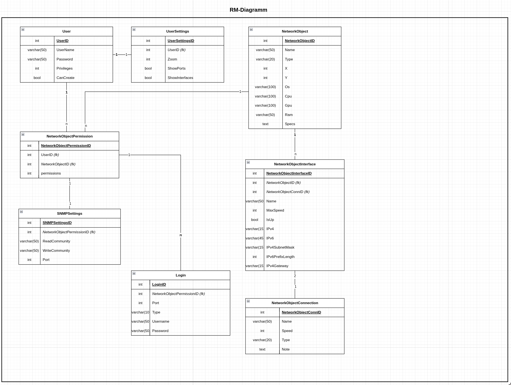

<link rel="stylesheet" href="style/rats.css">

  

# Datenbank-Design – RAT-Backend

Dieses Dokument zeigt das Datenbankdesign: Normalisierung (1NF → 3NF), das
Entity-Relationship-Modell (ERM) und das Relationale Modell (RM).

> Die vollständigen Zeichnungen liegen zusätzlich als bearbeitbare Diagramm-Datei
> in [`doc/assets/drawio/DB_Sketches_v2.drawio`](../assets/drawio/DB_Sketches_v2.drawio)
> (DrawIO). Die folgenden Tabellen geben denselben Stand als Text wieder.

**Legende für die RM-Übersicht:** <u>unterstrichen</u> = Primärschlüssel (PK), *kursiv* = Fremdschlüssel (FK).

---

# Normalisierung

## 1. Normalform (1NF)

**Nachweis:** Eine Relation ist in 1NF, wenn alle Attribute *atomar* sind (keine
Mehrfachwerte, keine zusammengesetzten Werte, keine Wiederholgruppen).

- Alle Tabellen speichern pro Spalte genau **einen** Wert (z. B. ein `Name`, eine
  `ipv4`-Adresse, ein `Type`). Es gibt keine Listen oder kommaseparierten Felder.
- Mehrfachbeziehungen (ein User hat mehrere Berechtigungen, ein NetworkObject hat
  mehrere Interfaces) werden über **eigene Zeilen in eigenen Tabellen** abgebildet
  statt über Wiederholgruppen → **1NF erfüllt**.

## 2. Normalform (2NF)

**Nachweis:** 1NF **und** jedes Nicht-Schlüsselattribut hängt *voll funktional* vom
gesamten Primärschlüssel ab (keine partielle Abhängigkeit von einem Teil eines
zusammengesetzten Schlüssels).

- Jede Tabelle hat einen **einspaltigen, künstlichen Primärschlüssel** (`id`).
- Bei einem einspaltigen PK kann es keine partielle Abhängigkeit geben – jedes
  Attribut hängt automatisch vom *ganzen* Schlüssel ab → **2NF erfüllt**.
- Die m:n-Beziehung *User ↔ NetworkObject* ist in die eigene Tabelle
  `NetworkObjectPermission` (mit eigenem `id`) ausgelagert; deren Attribut
  `permissions` hängt von genau dieser Zeile (User+Objekt) ab.

## 3. Normalform (3NF)

**Nachweis:** 2NF **und** kein Nicht-Schlüsselattribut hängt *transitiv* vom
Primärschlüssel ab (kein Nicht-Schlüsselattribut bestimmt ein anderes
Nicht-Schlüsselattribut).

- Account-bezogene Einstellungen stehen in `UserSettings` (1:1 zu `User`) und nicht
  in `User` selbst → keine transitive Abhängigkeit über den User hinaus.
- Geräte-Logins und SNMP-Settings hängen an der Berechtigungszeile
  (`NetworkObjectPermission`), nicht direkt am `User` oder `NetworkObject` →
  jedes Attribut hängt nur vom PK seiner eigenen Tabelle ab → **3NF erfüllt**.

---

# ERM-Diagramm

**Entitäten & Beziehungen (Kurzfassung):**

- `User` **1:1** `UserSettings` – jeder User hat genau einen Satz Einstellungen.
- `User` **m:n** `NetworkObject` – aufgelöst über `NetworkObjectPermission`
  (welcher User darf welches Objekt sehen/bearbeiten, mit `permissions`-Level 0–4).
- `NetworkObject` **1:n** `NetworkObjectInterface` – ein Gerät hat mehrere Interfaces.
- `NetworkObjectInterface` **n:1** `NetworkObjectConnection` – zwei Interfaces
  zeigen auf dieselbe Connection (= ein Kabel zwischen zwei Geräten).
- `NetworkObjectPermission` **1:n** `Login` und **1:n** `SNMPSettings` – pro
  Berechtigung (User+Gerät) können eigene Logins/SNMP-Daten hinterlegt werden.

---

# RM-Übersicht (Relationales Modell)

> <u>unterstrichen</u> = PK, *kursiv* = FK.

### User
| Spalte | Typ | Bemerkung |
|---|---|---|
| <u>id</u> | INTEGER | PK, autoincrement |
| username | VARCHAR(50) | unique, not null |
| password | VARCHAR(70) | not null (bcrypt-Hash) |
| is_admin | BOOLEAN | not null, default false |
| canCreate | BOOLEAN | default false |

### UserSettings  *(1:1 zu User)*
| Spalte | Typ | Bemerkung |
|---|---|---|
| <u>id</u> | INTEGER | PK |
| *user_id* | INTEGER | FK → User.id |
| zoom | INTEGER | default 100 |
| showPorts | BOOLEAN | default false |
| showInterfaces | BOOLEAN | default false |

### NetworkObject
| Spalte | Typ | Bemerkung |
|---|---|---|
| <u>id</u> | INTEGER | PK |
| name | VARCHAR(50) | unique, not null |
| type | VARCHAR(20) | z. B. PC, Switch, Router |
| x | INTEGER | Position auf der Topologie-Fläche |
| y | INTEGER | Position auf der Topologie-Fläche |
| os | VARCHAR(100) | |
| cpu | VARCHAR(100) | |
| gpu | VARCHAR(100) | |
| ram | VARCHAR(100) | |
| specs | TEXT | |

### NetworkObjectInterface
| Spalte | Typ | Bemerkung |
|---|---|---|
| <u>id</u> | INTEGER | PK |
| *network_object_id* | INTEGER | FK → NetworkObject.id |
| *network_object_connection_id* | INTEGER | FK → NetworkObjectConnection.id, nullable |
| name | VARCHAR(50) | |
| max_speed | INTEGER | |
| is_up | BOOLEAN | default false |
| ipv4 | VARCHAR(15) | |
| ipv6 | VARCHAR(45) | |
| ipv4_subnet_mask | VARCHAR(15) | |
| ipv6_prefix_length | INTEGER | |
| ipv4_gateway | VARCHAR(15) | |

### NetworkObjectConnection  *(Kabel zwischen zwei Interfaces)*
| Spalte | Typ | Bemerkung |
|---|---|---|
| <u>id</u> | INTEGER | PK |
| name | VARCHAR(50) | |
| speed | INTEGER | |
| type | VARCHAR(20) | |
| note | TEXT | |

### NetworkObjectPermission  *(löst m:n User ↔ NetworkObject auf)*
| Spalte | Typ | Bemerkung |
|---|---|---|
| <u>id</u> | INTEGER | PK |
| *user_id* | INTEGER | FK → User.id |
| *network_object_id* | INTEGER | FK → NetworkObject.id |
| permissions | INTEGER | not null, default 0 — 0=Hidden, 1=See, 2=Edit, 3=Admin, 4=Owner |

### Login  *(Geräte-Login pro Berechtigung)*
| Spalte | Typ | Bemerkung |
|---|---|---|
| <u>id</u> | INTEGER | PK |
| *network_object_permission_id* | INTEGER | FK → NetworkObjectPermission.id |
| port | INTEGER | |
| type | VARCHAR(10) | z. B. ssh, telnet, ftp |
| username | VARCHAR(50) | |
| password | VARCHAR(50) | |

### SNMPSettings  *(SNMP-Daten pro Berechtigung)*
| Spalte | Typ | Bemerkung |
|---|---|---|
| <u>id</u> | INTEGER | PK |
| *network_object_permission_id* | INTEGER | FK → NetworkObjectPermission.id |
| read_community | VARCHAR(50) | |
| write_community | VARCHAR(50) | |

---

RAT-Backend &middot; DBI 2025–2026 &middot; rats theme

